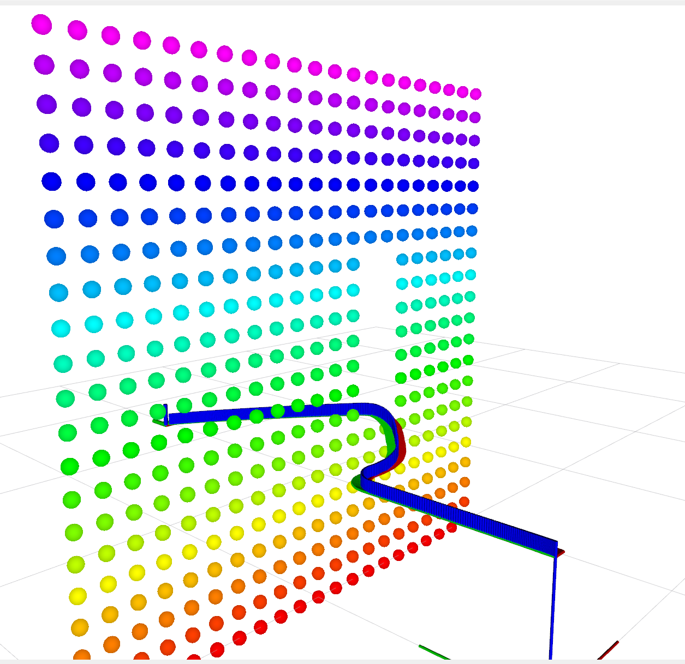

# Perception Pipeline

Goal: Fast (~30Hz) perception pipline for workspace approximation research for heuristic-based multi-agent planning framework (PMAF) by Laha et al 2023. Support both sim/real-world perception for multiple cameras.

<div style="display: flex; justify-content: space-between; align-items: center;">
    
    
    
</div>


## Requirements


| Hardware Stack                                     |
| ---------------------------------------------------- |
| 1. CUDA-capable PC (Our Setup: i7 8000U + RTX3070) |
| 2. Intel Realsense 435i (for Real-World)           |
| 3. Franka Emika Panda Robot Arms (for Real-World)  |


| Software Stack                                                                                                      |
| --------------------------------------------------------------------------------------------------------------------- |
| 1. Ubuntu 22.04 Jammy Jellyfish ([iso](https://releases.ubuntu.com/focal/https:/))                                      |
| 2. ROS 2 Humble ([debian](http://wiki.ros.org/noetic/Installation/Debianhttps:/))                                   |
| 3. Conda + CUDA ([instructions](https://x.com/jeremyphoward/status/1697435241152127369))                            |
| 4. librealsenseSDK ([debian](https://github.com/IntelRealSense/librealsense/blob/master/doc/distribution_linux.md)) |
| 5. Docker ([instructions](https://github.com/tanmayyb/setup/blob/main/docker.sh)) |
| 6. Sim (Under Development)      |

## Setup

- Install aforementioned requirements and clone this git repo
    ```
    git clone https://github.com/tanmayyb/percept.git
    cd percept
    git submodule update --init --recursive
    ```

### Percept (Native)

- Create a virtual environment and install all dependencies and libraries
    ```
    ./setup.sh
    ```

- Build the workspace
    ```
    . build.sh
    ```

- Run the perception pipeline
    ```
    ros2 launch percept rs_static.py
    ```
- Or source the environment if not already sourced
    ```
    . env.sh
    ```

### GA Circular Fields Planner (Docker)

- Allow docker access to X11
    ```
    xhost +local:docker
    ```

- Build the container
    ```
    docker-compose up -d
    ```

- Connect to the container
    ```
    docker exec -it ga_cf_planner bash
    ```

- Start the container if it is not running
    ```
    docker start ga_cf_planner
    ```

- Inside the container:
    ```
    . build.sh
    ros2 launch experiments oriented_pointmass_launch.py
    ros2 launch experiments manipulator_launch.py
    ```

Note: `src/ga_cf_planner` is mounted as a volume in the container. Changes made to that directory inside the container will be reflected in the host machine.

## Credits

### Collaborators

- Tobias Loew
- Riddhiman Laha
- Tinayu Ren

### Projects

- Gafro
- CuPoch
- Maniskill

## Performance


Performance w/o RBS:


